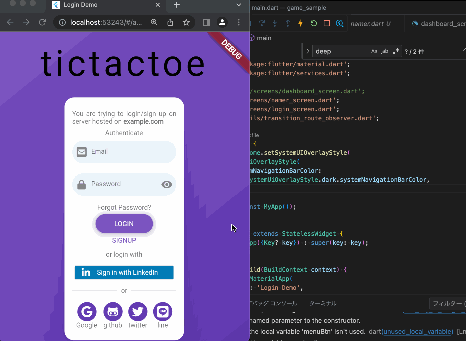

# game_sample

A new Flutter project.

WIP

web/index.html で goolgmap のための API KEY を設定する必要があります。(for web)

game は auto-gpt を使って生成しています。cpu 側は min-max 法を使っています。

indicator に使っている画像は, web上のフリー画像です。


firebase のプロジェクト： game-sample
Authenticator で mail/passowd 認証を有効にしておきます。
サインアップしたユザーは、firebase の コンソールで確認してできます。

```zsh
dart pub global activate flutterfire_cli
flutterfire configure --project=game-sample-******
```

## screenshot

### anmimation gif


### game 画面, indicator 画面, google map 画面


### email/password, github での login


## See

- https://github.com/NearHuscarl/flutter_login
  flutter login

- https://dartpad.dev/?id=e7076b40fb17a0fa899f9f7a154a02e8
  namer (高度な最終的なコード)

- https://dev.classmethod.jp/articles/flutter-smooth-page-indicator/
  ページインジケーター機能を実装する

- https://qiita.com/yoshikoba/items/e4c8eae14735e7304902
  iOS/Android/WebでGoogleMapを表示する

- https://firebase.google.com/docs/auth/flutter/start?hl=ja
  Flutter で Firebase Authentication を使ってみる

- https://firebase.google.com/docs/auth/flutter/federated-auth?hl=ja#web
  フェデレーション ID とソーシャル ログイン

- https://zenn.dev/welchi/articles/firebase-auth
  FlutterへFirebase AuthenticationとGoogle Sign-Inで簡単にログイン機能を実装
